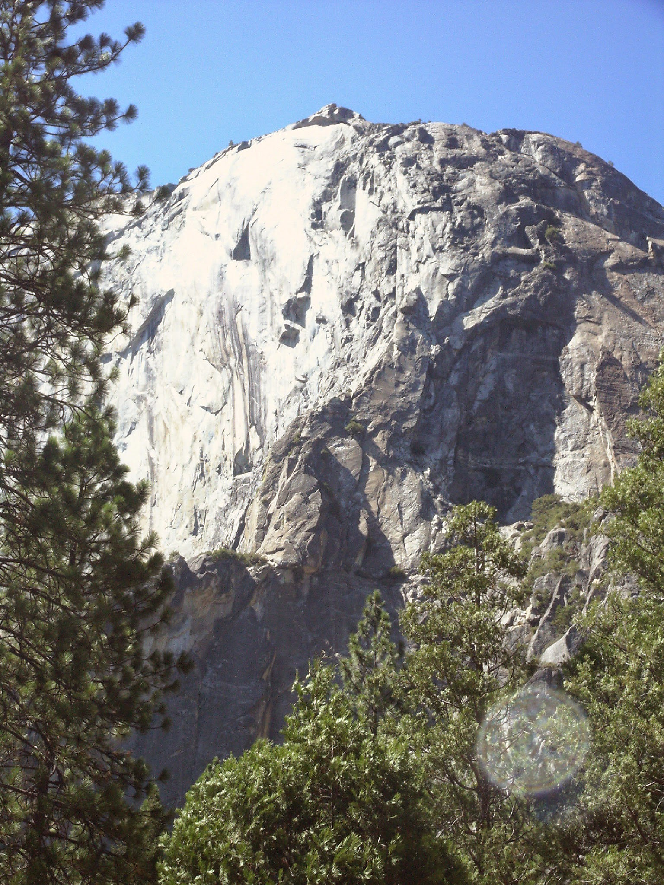
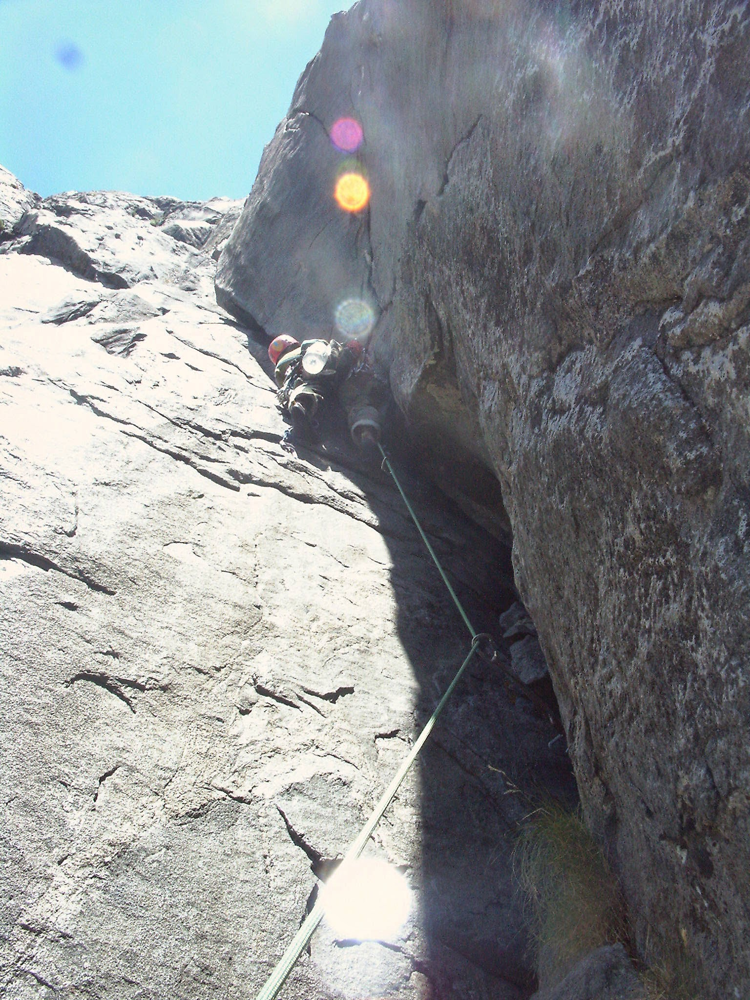
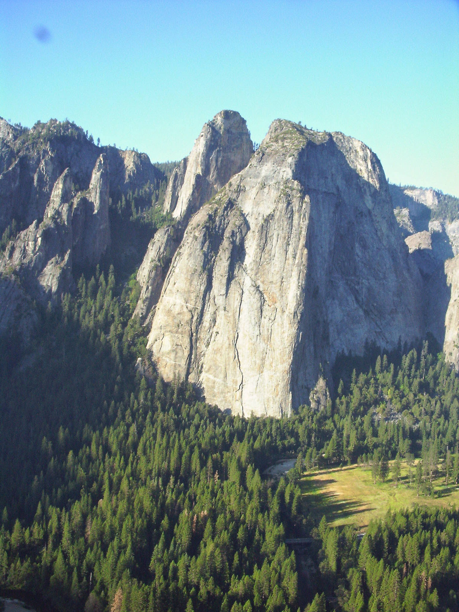
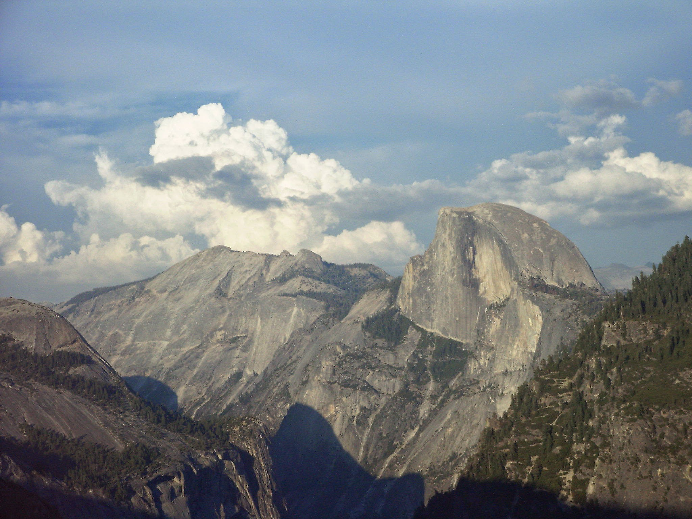
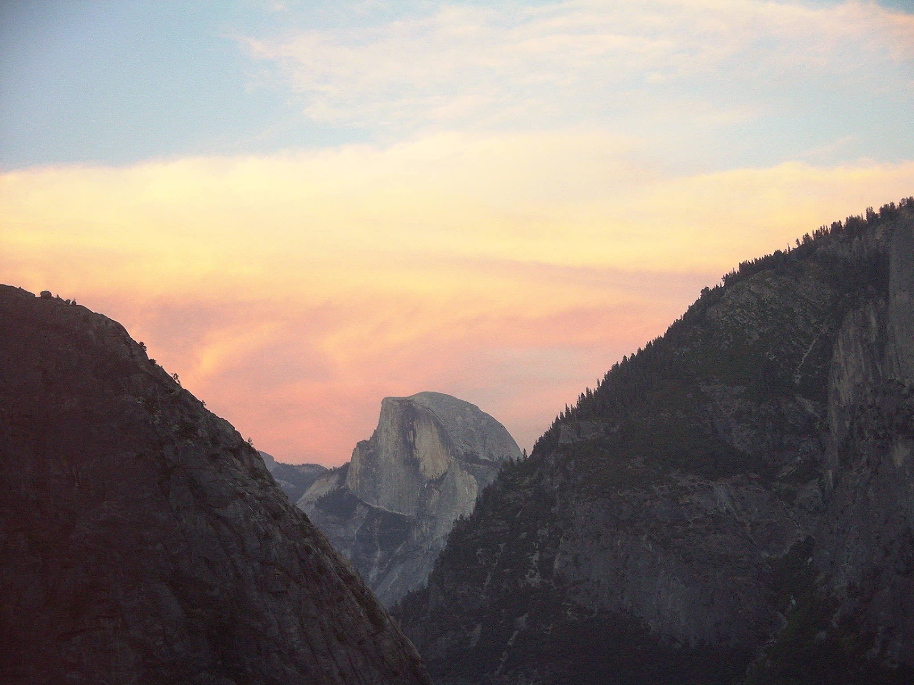
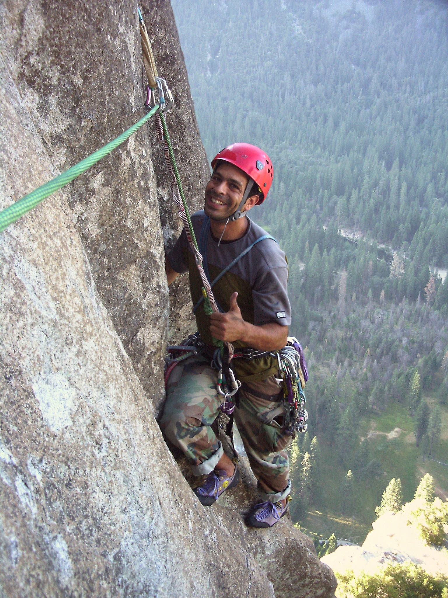

Title: Climbing Life Lessons: Offwidths
Date: 2021-05-01
Category: Productivity
Tags: agile, project-management, project-planning, research, rant, time-management
Authors: Mark Mikofski
Summary: An offwidth is a difficult climb, too big for hand jams, but too small to chimney. 

# Life Lessons from an Offwidth

The [East Buttress of El Capitan](http://www.supertopo.com/rock-climbing/Yosemite-Valley-El-Capitan-East-Buttress) is one of the best but hardest climbs I've ever been on. It's long & sustained, with huge exposure & beautiful, sweeping views of the valley & Middle Cathedral. In typical Yosemite fashion, it challenges you right from the get go with a steep chimney overlooking a 1,000-foot drop. Then on the 9th pitch, after you've been climbing for a few hours, over 2,000 feet above the valley floor, there's a classic Yosemite offwidth. Like glacial polish, Yosemite offwidths are a ritual you can't avoid. You just have to stash your ego, open your heart, and humbly listen to what the great mother is trying to teach you.

That's me, 20 years ago, on that incredible, unforgettable flaring 9th pitch. An offwidth is a difficult climb. It's too big for hand jams, but too small to chimney. Everybody has advice for offwidths: armbars, heel-toe jams, chicken wings, kneebars, shoulder jams, handstacks, liebacks, you name it. About the only advice worth following comes from climbing and squirrel suit legend [Steph Davis](https://stephdavis.co/blog/how-to-climb-offwidths-101/):

>I think the biggest thing with offwidths is to remain calm and be patient.

She makes it sound so easy! However, there's another dimension that exponentially increases the challenge. Placing protection on offwidths is no joke. First, it's no fun lugging a giant cam 1,000 vertical feet just to use it once. Oh, did I mention the 9th pitch is one of the longest? So make that two huge 5-inch cams. So far we have challenging, sustained, strenuous technique combined with sketchy, runout pro, fatigue, and huge exposure. Oh, but did I mention the breathtaking, awe-inspiring views? Look right across the yawning expanse of the valley is the mighty Middle Cathedral rock! And behold Half Dome!

Feeling good now? So what exactly is the great mother trying to teach us? Trust. Relax. Move intentionally, methodically, and don't hesitate. Above all, resist the urge to bump or reposition your pro. What's this? Remember we only have one gigantic cam with us on this slog, we're scared and tired, so it might seem logical to reach down and pull that cam up, or maybe you spy the perfect placement you couldn't find when you shoved it in desperately thinking you might slip out any second. Sometimes if you're lucky on a nice evenly spaced marathon, maybe you can bump the cam over your head a few times as you move up. However, these dream parallel chasms only exist in Canyonland sandstone. Out on the granite cliffs of the valley, unfortunately you're more likely to accidentally lose your only last good pro as the cam tips out into a sudden widening or jam in the back never to be retrieved again. Your second will curse you, other parties will praise you as they clip this fixed pro, and later a seasoned YOSAR regular will pull it out as the rock changes, reading it like an ancient magic rune. A [Climbing magazine](https://www.climbing.com/skills/learn-this-offwidth-protection-primer/) primer summarizes the cons well:

>If the cam tips out or falls down the rope, you could end up way above your last piece. Worse, it could knock out that last piece—and possibly your belayer. Be careful not to push your cam into a spot that’s too tight, too tipped out to hold a fall, or out of your reach.

Of course use long slings so you don't inadvertently walk your cam out of its spot, and suffer the same fate as if you bumped it yourself. Argh! There are so many things to consider, and you're in a really tight spot (pun intended). So don't try any 11th hour dramatics. Leave the gear where it is, keep moving, find another placement deeper in the crack, maybe back it up. Climbers have an old saying that is part cheek and part truth.

>When in doubt run it out.

It means keep climbing. Unless you're going to downclimb or retreat, it's better to keep making forward progress, than to burn out in a precarious situation. Chances are you will power through the moves, and more often than not the rock offers you a neat solution that saves your ass in the nick of time. But you won't have the juice to make those moves, or the brains to read what the rock is telling you, if you spin out trying to fix a piece of pro that's already your best placement.

So what's the lesson? How does this apply to me, in my office, clicking a keyboard? Have you ever had a project or a product that's about to ship? And your boss calls you at 11pm, and says, "Hey change this thing." Or maybe you're the boss, and you call your team with a desperate hail Mary pitch at the last minute. **Don't. Just. Don't!** Calm down. Relax. Trust your team. Stick to the plan. The most important part is sending the project. Whatever your idea is, it's just not worth it. Or maybe it is? But you better be damned sure, because you had a product ready to ship. Are you certain you really want to fuck it up on a Friday night? Why not sleep on it? Maybe in the morning, when you start getting feedback, some bad, some good, on the product that you _actually_ delivered, you'll be glad that you didn't almost bomb everything.

This is the lesson. After the 9th pitch, the climbing on the East Buttress was still hard, not technically, but we had reached the end of our rope (no pun this time), and we were fried. There was some mundane 5-easy, exposed traversing with awful rope drag, but we made it to the top. And what a top out it was. Half Dome ablaze in the most glorious sunset of my life.

The descent is actually the most dangerous part of the climb. Something like 70% of climbing accidents actually happen when parties rap off the ends of their ropes, because they're too tired to pay attention to tiny but crucial details. We descended the famed East Ledges which true El Cap warriors rap from when they finish big wall test pieces like the Nose. There were fixed ropes that looked good enough, and we stuck the finish, with an elated sense of the sublime. The great mother had graced us with her wisdom, and we had tried our best to suss it out.

So maybe that's the lesson? To keep it all in perspective? We had planned this trip, read the guides, studied the topo maps, racked our gear with intent, rose early and given it our best. We were lucky that we didn't have to improvise. We were given a cake walk, and we ate it up.

Thanks for listening. Here's me right before the crux 10b move after the chimney. Not a care in the world.

