Title: Climbing Life Lessons: Reassessing Changing Risk
Date: 2023-07-14
Category: Productivity
Tags: project-management, project-planning, research, rant, risk-management
Authors: Mark Mikofski
Summary: Reassessing risk as conditions change is critical in the backcountry.

# Reassessing Risk in Mountians

[Snake Dike](http://www.supertopo.com/rock-climbing/Yosemite-Valley-Half-Dome-Snake-Dike)
is on the southwest shoulder of Half Dome, perhaps the most recognizable rock face in
Yosemite Valley. Although considered a moderate climb, rated 5.7 R, it's sometimes called
"Snake Hike" because it's a serious commitment with huge exposure.

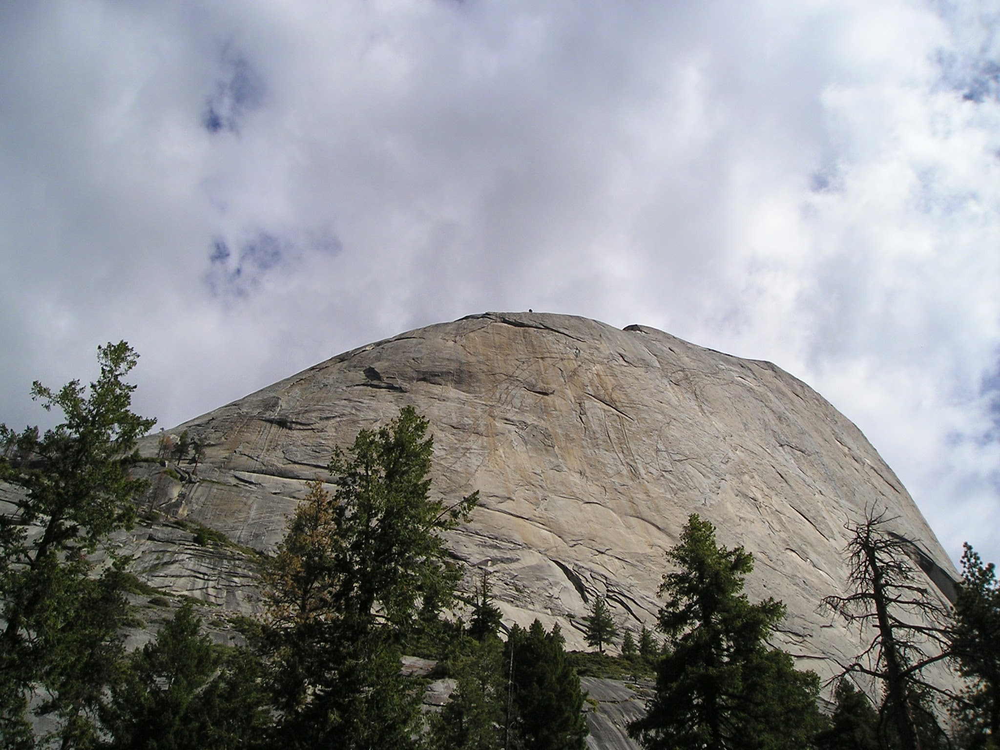

Understanding risk on Snake Dike is important. This climb requires planning, good timing,
a bit of skill, and lots of luck. More importantly though, you need to be constantly
aware of changing conditions, how they can affect your risk, and whether bailing is still
an easy option. Evaluating risk is one of climbing's life lessons.

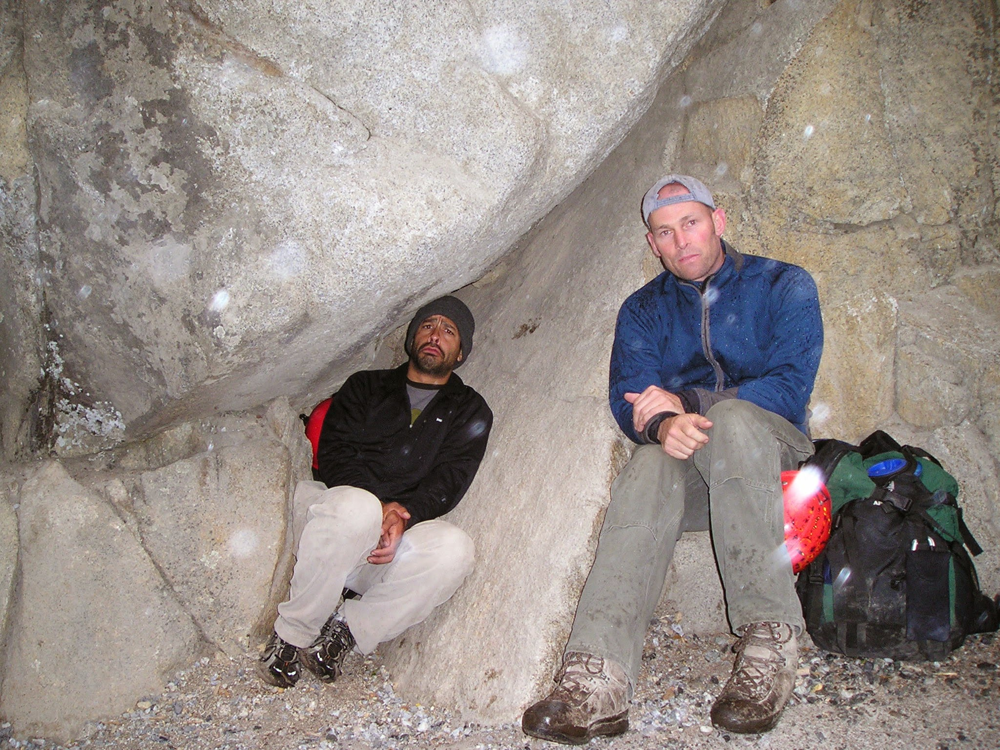

Snake Dike is an all day climb. The approach is a 6 mile, 3-hour hike up 2500-ft that starts
at Happy Isles behind Curry Village and follows the Mist Trail, one of my favorites.
Unfortunately, our 4am start was quickly foiled by rain, but our good timing gave us some
flexibility, so we decided to wait it out for at least an hour and then reassess. Lucky for us
our patience was rewarded, and within the hour we were back on the trail. We decided to pick up
the pace a bit to make up for the lost time. Getting caught in a thunderstrom can have deadly
consequences for climbers, so even though there was no rain in the forecast that day, we didn't
know if the weather would turn bad again later that afternoon. Same as for climbers, descending
the cables from Half Dome in a thunderstorm is a death sentence. We also didn't want to hike out
in the dark, although we had brought our torches and some emergency overnight gear just in case.
There's always trade offs to consider in the backcountry, so we tried to pack as lightly as we
could to move fast yet still be safe. There's a saying in the mountains:

> Speed is saftey.

It means don't waste time, so we didn't. Ok, well maybe we stopped to take a few photos of the
breathtaking views near Lost Lake.

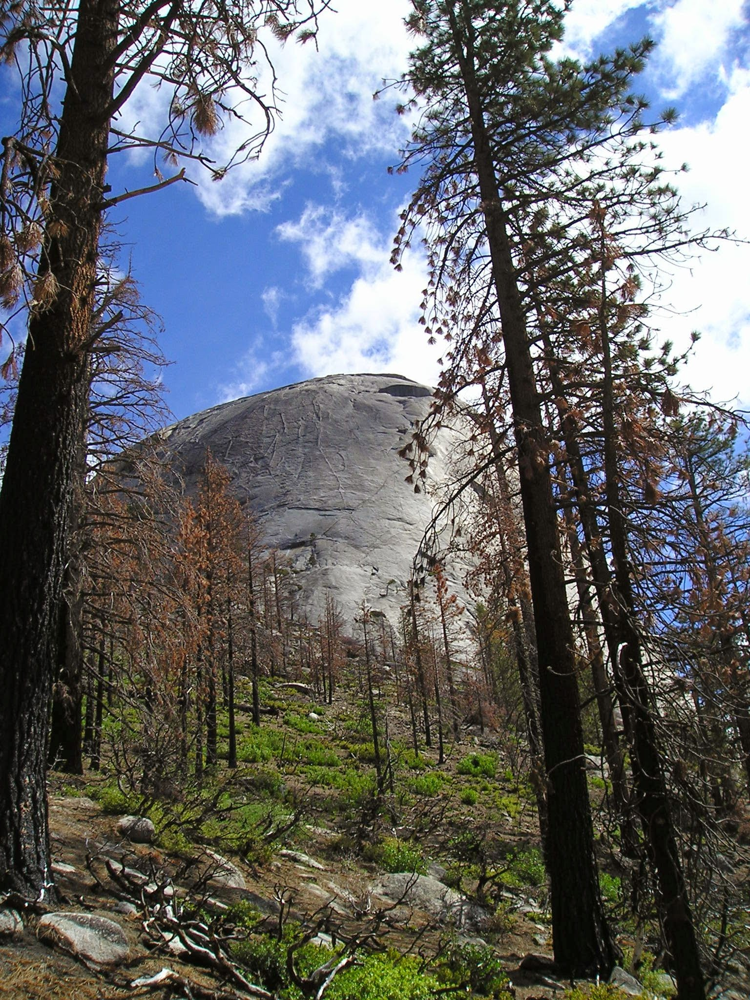

I had climbed Snake Dike once before with a large group of experienced climbers, and I'd been on the
Mist Trail numerous times, so I had good intuition for finding the right path to turn off the trail,
and miraculously we nailed the approach. We ate a quick snack, tied on our climbing shoes, strapped
on our harnesses, clipped on a light rack (mostly slings & quickdraws), and tackled the first pitch
which is actually one of the 5.7 cruxes of the climb. The "R" stands for "runout" which means there's
no protection. That pretty much describes most of Snake Dike, but the first pitch is especially gnarly.
It starts on typical Yosemite glacial polish with tiny microedges that you can friction climb up to a
roof where you can finally place your first solid piece and exhale a huge sigh of relief. If you slip on
this slab, you'll get some serious scrapes as you tumble back to the base of the climb. In researching
for this blog, I read an
[incident report from YOSAR](https://www.nps.gov/yose/blogs/rescue-from-near-snake-dike-half-dome.htm)
about a couple that were off route but slipped on similar frictiony slab, tumbled to the base, and
dragged the belayer, who was not clipped to anything, off her ledge and into a talus field. She had a
punctured lung, a fractured pelvis, and broke two vertebra. Climbing can be especially dangerous if
you're unlucky, don't  take precautions, and fail to assess your risk carefully. I'm not trying to
scare you, lots of things are dangerous, that's why it's important to know your risk and make conscious
decisions. Anyway, I pulled the roof, shimmied up to the ledge and made the only anchor with pro I'd
need during the entire climb. From there on out is was bolt city.

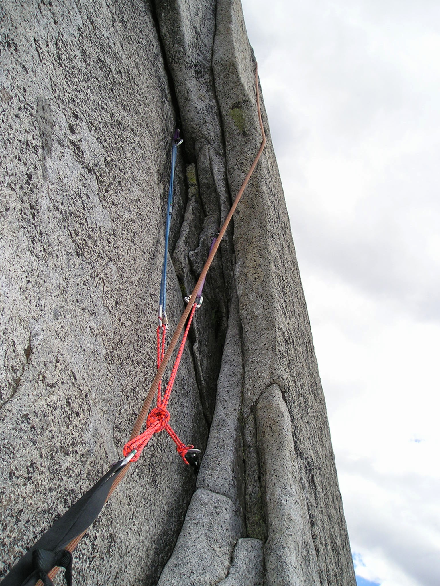

That's the SERENE anchor, a cordelet with 3 equalized cams, _a la_
[climbing anchors by Jon Long](http://falcon.com/books/9780762782079). Pay attention
to that black webbing because it's got a bit part in this story later on. I swear
my second has a backup clove hitch on a 4th piece out of the frame you can't see,
so he can escape the belay.

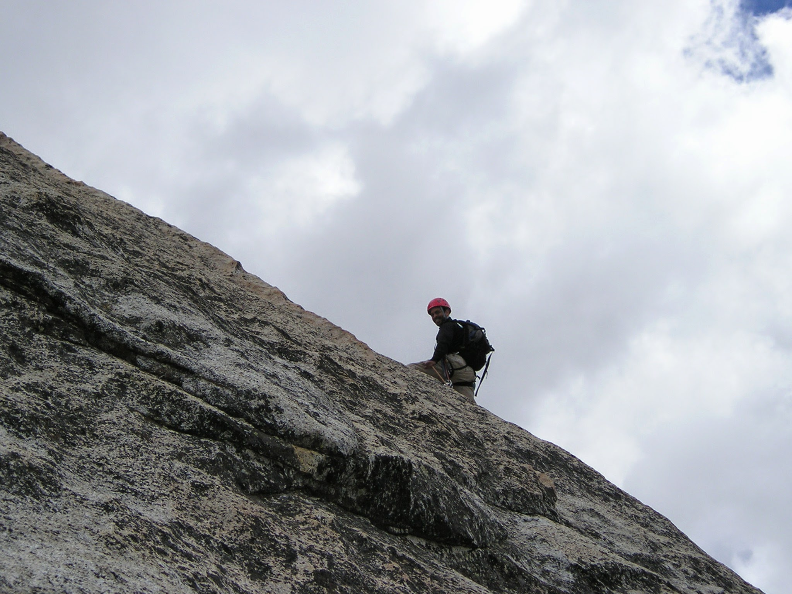

There's one more sketchy traverse on frictiony slab protected by a single bolt,
and then the rest of Snake Dike is all jugs and 5 easy. You should download the
[free supertopo](http://www.supertopo.com/topos/yosemite/snakedike.pdf) if you're
serious about climbing Snake Dike. I had tried to memorize it, because there are so
many bolts on this climb that it's easy to either stop early or skip an anchor.
People talk about girth hitching chicken heads but the dike doesn't really take
protection. It's just a long juggy extrusion that you follow like a ladder.

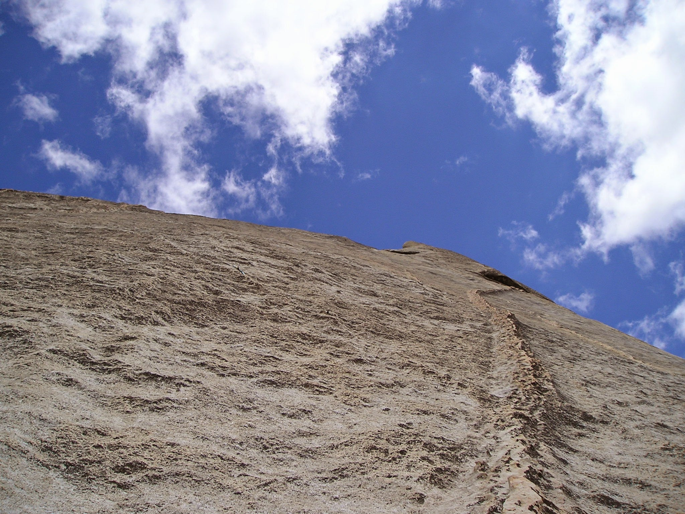

All the rest of the pitches juggy and positive but super runout with just a single
bolt every 60 feet or so. Some of the pitches have zero bolts! But every so often
you come across a pair of bolts that look like an anchor, that are for shorter ropes.
Knowing where to belay is part of route finding that can speed up your climb, and
remember, "speed is safety!" Clip the wrong bolts though, and you might find yourself
and your partner simul-climbing.

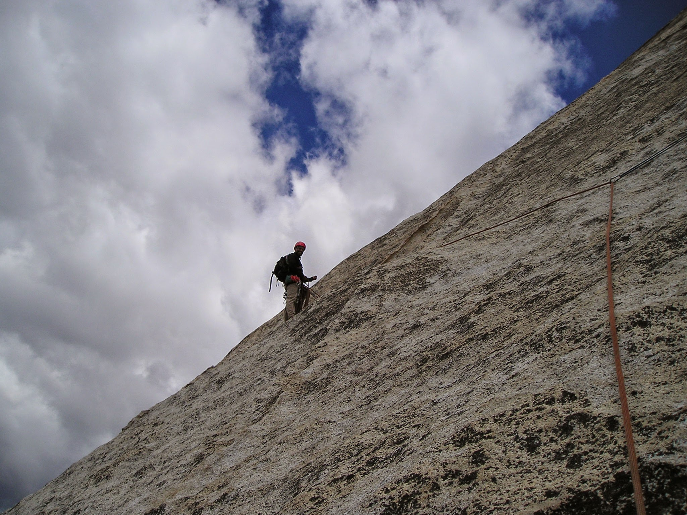

The climbing was smooth, and the and views were s0pectacular. Take a moment to
appreciate this sweeping vista starting to your left past Glacier Point right
to the valley floor and is that El Cap in the distance? 

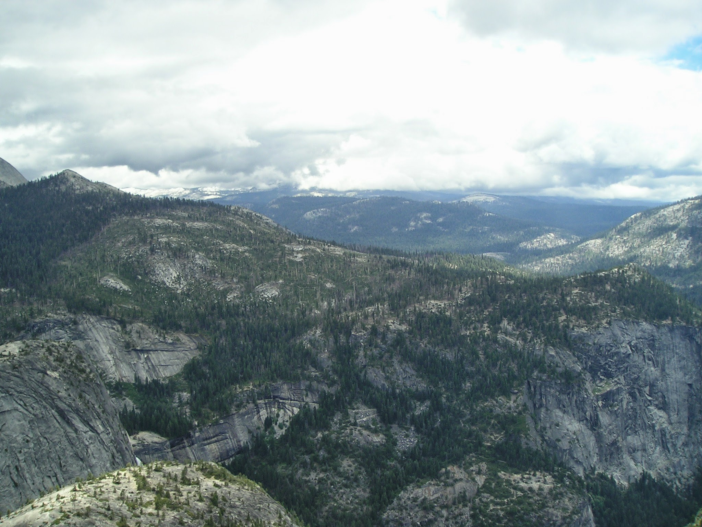
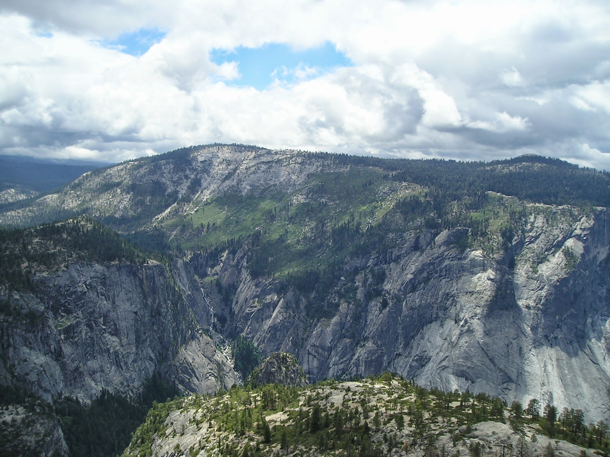
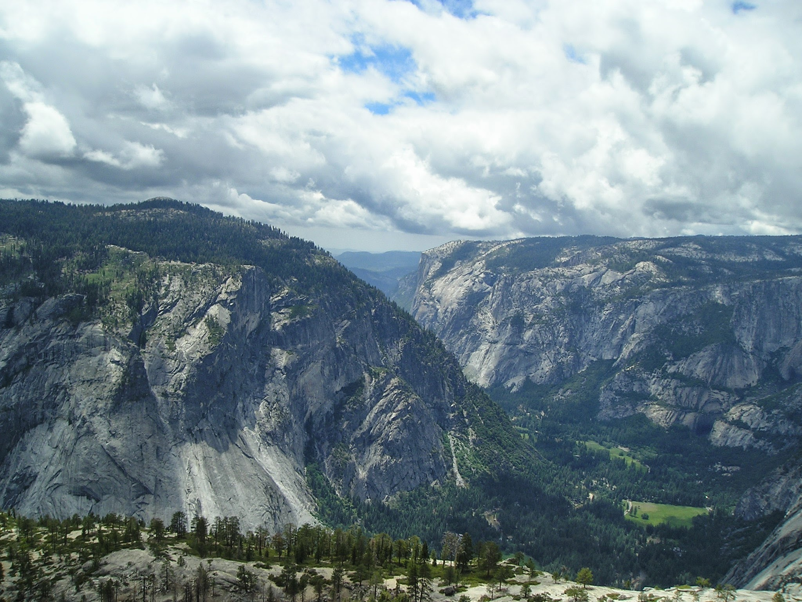

Look just a little furhter to the left though and you can see what I was seeing.
Dark clouds gathering around Liberty Cap and Mt. Broderick were moving our way. We
needed to pick up the pace, or we would end up with only bad options.

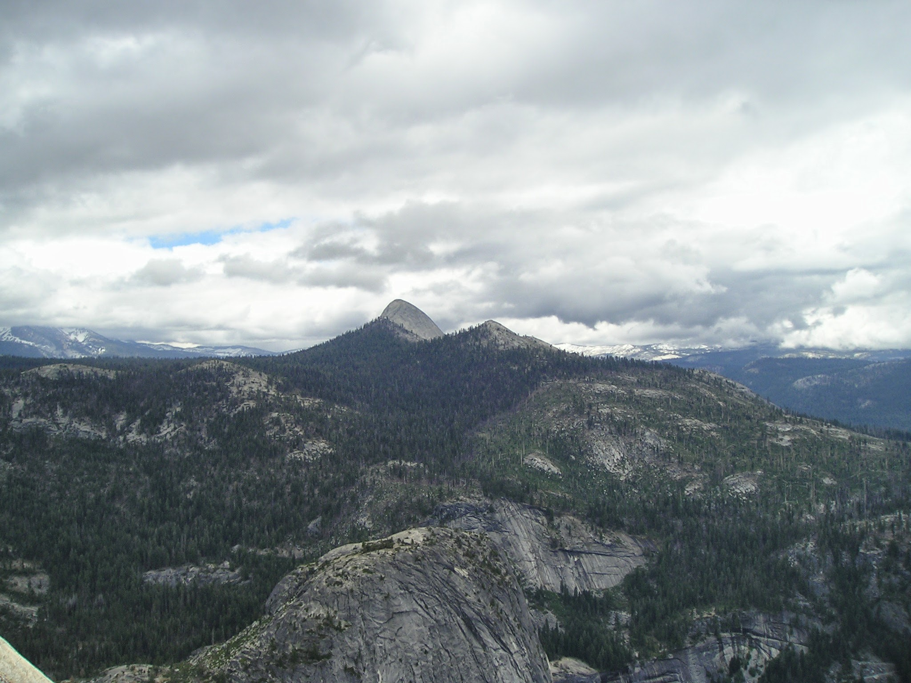
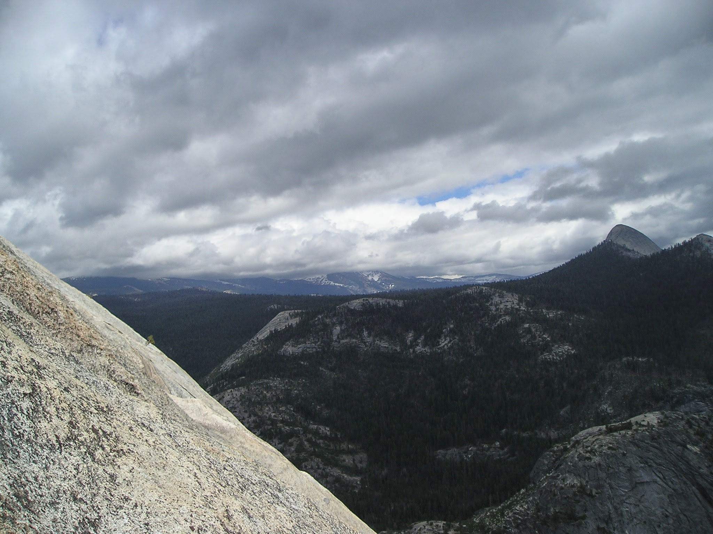

Is there anything that is purely deterministic? I believe almost every event has
a distribution of possible outcomes, some good, some great, some bad, and some
very bad. Lucky or not, those possibilities aren't usually random, some outcomes
are more likely than others. So now I had to weigh the odds that we could summit
and decend before it start raining. The main danger for climbers in the rain is
lightning. For a quick primer check out this Climbing Magazine article,
[Don't Get Struck By Lightning](https://www.climbing.com/skills/learn-this-laws-of-lightning/).

In my haste, I made a tactical error. After clipping a pair of anchor bolts,
I decided to pass them thinking they were for shorter ropes, but before I knew
it I was literally at the end of my rope. I had clipped the bolts between me and
my second, and I knew there was another pair of anchors just up ahead. I felt confident
so I decided to start simul-climbing, and I yelled down to my partner, "START CLIMBING!"
A 60-meter rope is almost 200-ft long, and in the vastness, sounds get blown away, so I
just started yanking on the rope forcing him to follow me upward. This worked for a few
feet but then I was yanked to a stop. I could see the next pair of anchors, but they were
just out of reach. I turned around to start screaming frantic, feeling the buzz
of adrenalin shoot into my veins, when I saw my partner take off his backpack. I was
completely confused. Dread crept into my bones as I saw something flutter off into
the breeze, but I was quickly filled with relief as my partner slung his backpack
and lept upward. I flew to the anchors, clipped them like a baby hugging his mother
and hauled up my parter. "What the helk was that?" I asked as he got closer, and he
explained that he had climbed to the end of that black piece of webbing, but it was
too tight and he couldn't reach down to unclip the locking carabiner I'd lent him,
so he cut the sling and left the biner.

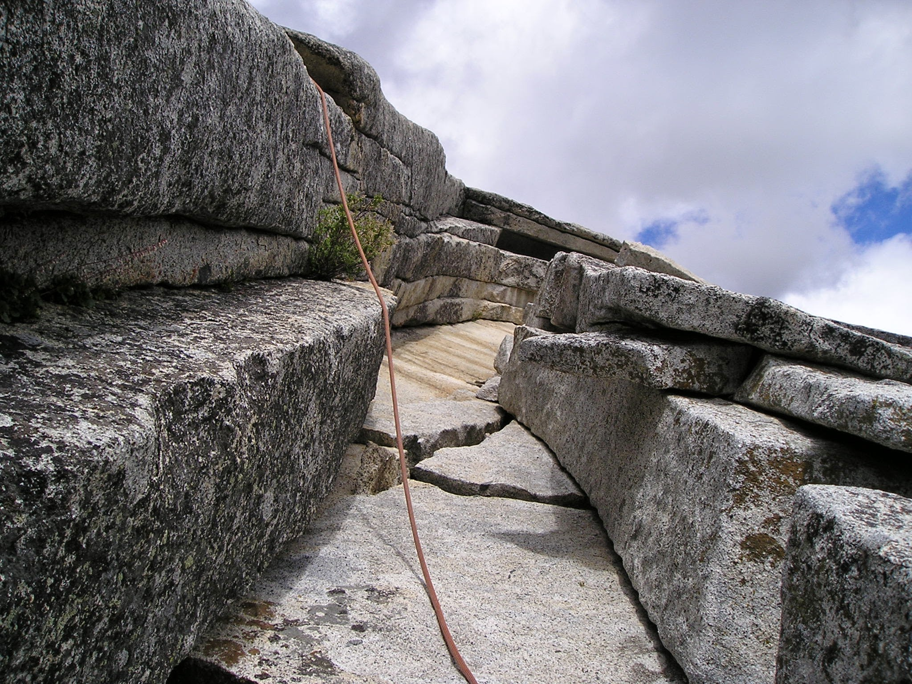

Mini epic almost over, the rest of the climb was uneventful. We reached the third class
scramble while there were still patches of blue in the cloudy skies, but once on the
summit, while taking victory photos and scarfing food, it started snowing and we
knew we had to sprint down the cables. 

We reached the bottom and started planning our celebration with cocktails at the
Mountain Bar at the Lodge. There we reflected on the choices we made during the
day as the conditions changed, and we reassessed our risk. Our planning didn't
consider the surprise mini-epic, but a little skill and a lot of luck kept us
safe. I don't think either of us were particularly risky, even before we had kids.
Sure, there's a spectrum, and each person has to make a conscious choice of the
risks they're willing to take, but to do that effectively requires understanding
and evaluating the risk especially as conditions change. 

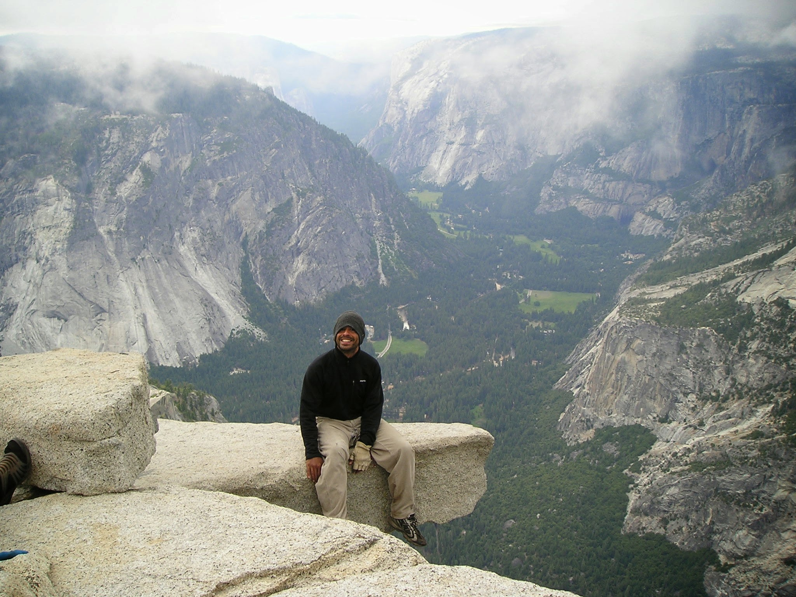

Here's me 20 years ago, after that Snake Hike, on the infamous diving board,
overlooking the valley. I reflect back on my climbing experiences, and I realize
that of the many valuable lessons I learned in the mountains, assessing risk
has been one of the most useful. Understanding uncertainty has helped me navigate
an often uncertain world, and to realize that as conditions change, I can re-evaluate
my risk and make different choices. You can too. Thanks for reading!

My Notes:
x Any event has a distribution of possible outcomes, some that are more favorable than others and some that are definitely undesirable.
x The distribution might not be random, in other words some outcomes might be more likely than others.
x Risk assessment is a measure of the possibility of favorable and undesirable outcomes.
- Each person's or party's tolerance for risk is a choice that depends on trade offs between the chances of favorable vs. undesired outcomes.
- changing conditions force you to reavaluate the rist and make new choices.
- Sometimes conditions and risk can change quickly, leaving you exposed to greater risk.
- Exposure in theoretical terms is a measure of the level risk you've accepted but in practical terms it's measured in how far or long it will take to escape danger and get to help.
- climbing in the mountains automatically increases your exposure because it can be difficult to escape the rock safely.
- climbing in the backcountry can increase exposure significantly because in addition to a safe retreat you may also need to hike and drive significant distances before you can get help.
- Dangers in the mountains include route finding, getting caught in bad weather, darkness, lightning strikes, equipment failure, missing or losing equipment, falls, injuries, death
- learning to evaluate risk in changing conditions is an important skill that can have practical advantages in all aspects of your life.
- it can help you tolerate uncertainty, because reality is both full of possiblities and uncertainty
- it can help you rule out unlikely or scenarios with no serious consequences
