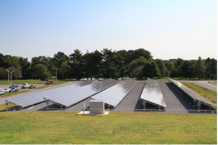
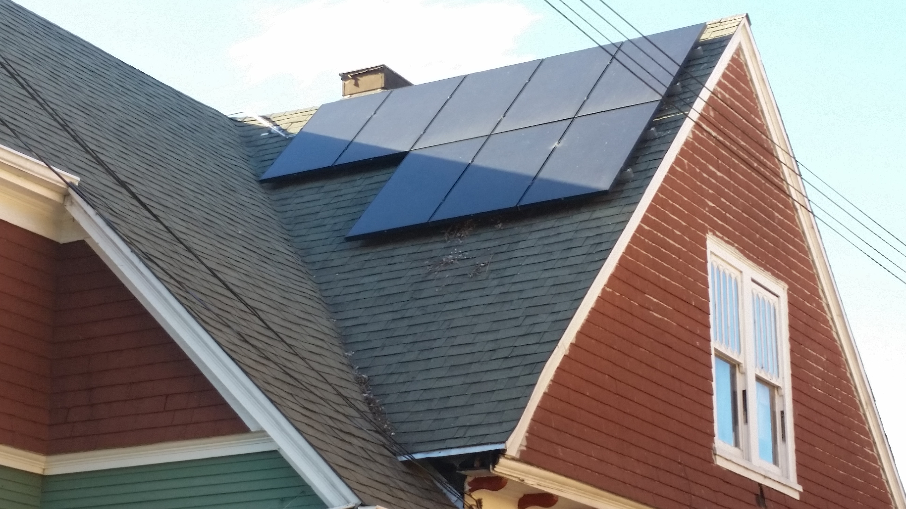
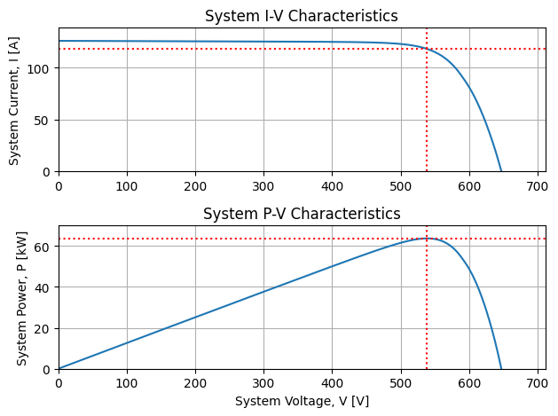
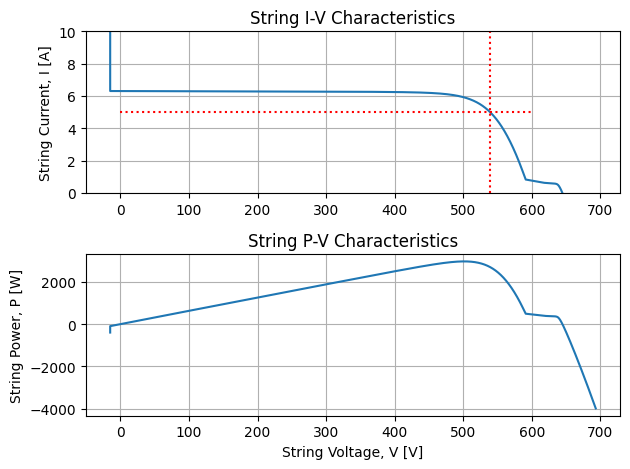
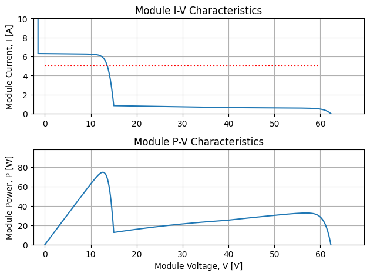
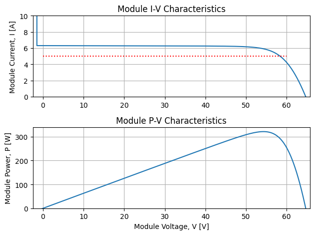

Title: PV Electric Mismatch in Silicon-Cell PV - Part 2
Date: 2024-08-23 01:10
Category: Solar
Tags: solar, modeling, code
Authors: Mark Mikofski
Summary: What happens when shade cuts across PV strings?

> Note: This post is part of a joint blog with my colleague Kurt Rhee:
[Primer on Electrical Mismatch](https://kurt-rhee.github.io/2024/08/26/a-primer-on-electrical-mismatch)

# The many shades of PV electrical mismatch
Effects from shade are complicated, but can be summarized in two orthogonal categories:

1. [shade parallel to strings](#shade-parallel-to-strings)
2. [shade perpendicular to strings](#shade-perpendicular-to-strings)

These categories were defined in the Fast Shade Model [[1, 2](#references)]
developed by Dr. Bennet Meyers after simulating hundreds of different shade
patterns and grouping them by their electrical mismatch. 

## shade parallel to strings
One example of shade across all modules that is parallel to strings, is row-to-row
shade in fixed-tilt systems, typically in winter. When I originally wrote
about [PV electrical mismatch]({filename}PV-electrical-mismatch.md), I analyzed
this type of shade using [PVMismatch](https://sunpower.github.io/PVMismatch/)
to simulate shade across the bottom row of a single string of 10 modules in a
10 string system. The conclusion of that post was that the string performed as
well as the most shaded cell, so even though only the bottom cells were shaded,
the modules in the string lost most of their power. I shaded the bottom cells
80% to simulate only diffuse light, and the string lost roughly 80% of output.
The other 9 strings operated at full capacity, so the system only lost 8%. The
[NIST ground mount array](https://www.nist.gov/el/energy-and-environment-division-73200/heat-transfer-alternative-energy-systems/photovoltaic-1)
is an example of a system that will have row-to-row shade in winter that will
cause most of the strings to lose almost all of their output even when only
the bottom row of cells is shaded.

## shade not parallel to strings
However, that post also contained a picture of a rooftop with non-uniform shade
that was not consistent across each module of the string. The shade cast from
the roofline cut diagonally across the modules in the string, which was wrapped
in two rows to fit.

I didn't analyze the shade from this system in that post, so it raises the
question whether the rule of thumb I recommended would still apply?

## shade perpendicular to strings
To simplify the question, the rest of this post analyzes a PV system with a
shade obstacle like a wind turbine, a telephone pole, or a chimney, that casts shade
perpendicular to the strings. My analysis is in this Jupyter notebook on Google Colaboratory:
[`mismatch_vs_strings.ipynb`](https://colab.research.google.com/drive/1b2Ll7G-4WBKPl57m-FPBhU8MLjLOTfIb)

>TL;DR: When shade cuts perpendicular to strings, cells go into reverse bias,
bypass diodes activate in the shaded submodules, and the other modules operate
at higher voltage to match the voltage of unshaded parallel strings.

I simulated perpendicular shade on the first half of the first module in the
string, while the rest of the strings were unshaded. For example, this shade could be caused by a
chimney. Then I increased the number of unshaded strings to see if it changed
the effect. The effect of a shadow perpendicular to the string caused bypass
diodes to trigger. Adding more strings did not stop the bypass diodes from triggering, even after 20 parallel
strings. The IV curve of the system had a kink until 4 unshaded parallel strings were added, but after 9 unshaded parallel strings were added, the IV curve
appeared unaffected. After 19 unshaded parallel strings were added, the total power loss was only 0.85% for the system
compared to unshaded. However, the power loss in the shaded string was about 15%.

Here is the IV curve of the 20 string PV system with perpendicular shade on the
1st module of the 1st string from the Jupyter notebook. It looks unaffected!

Now check out the IV curve of the string with the shaded module. It should
be generating about 3200[W], but even though it's lost about 500[W], it
still operates at 5[A], nearly the same current as the other strings. It
still has to operate at the same voltage as the other strings, 538.7[V] in
this example, so how does it do it with 2 bypass diodes activated?

A look at the module IV curves tells the rest of the story. The shaded module
still has to carry the 5[A] of the string, but 2 bypass diodes are triggered
so the voltage is down 75%. Note: these are SunPower/Maxeon 320[W] modules,
that have 96-cells in 8-columns with 3 bypass diodes in a 24-48-24 cell arrangement.

However, the unshaded modules make up for the lost voltage in the shaded
module by operating just above the max power point. This is why the string
is operating at 5[A], to increase the voltage in the unshaded modules.
Very clever! Go team! Luckily for the shaded module, that current is
also very close to its max power point, which is only down 75% thanks
to the activated bypass diodes. Recall in the parallel shade scenario,
the entire string was down.

Please check out [`mismatch_vs_strings.ipynb`](https://colab.research.google.com/drive/1b2Ll7G-4WBKPl57m-FPBhU8MLjLOTfIb)
because the 1-string example isn't limited by the voltage of parallel strings, so it's free to operate at the max power
point, and the losses are lower. Recall in the 20-string example, the shaded string lost about 15%, but in the 1-string
example, the loss was only about 8%. Another variation is allowing the shade to cross two or more strings. I covered
a scattershot of scenarios and found that parallel string voltage began to dominate sowmhere between 5 to 10 strings.
Of course, that only applies in this contrived example, but it was interesting nonetheless.

## Conclusion
I wish I could say, that's all there is to it, but as I said in my first blog post,
electrical mismatch in crystalline silicon is very counter-intuitive.
That's why I created PVMismatch to begin with. I was tired of guessing and
being wrong. So don't guess. Simulate with confidence, try PVMismatch, and
let me know what you learn!

## Epilogue
So back to that rooftop with the diagonal shade line. It's a bit of both
categories right? How do you think it will perform? Will it lose nearly
all of its power or will bypass diodes active and save the day? Or maybe
something in between or completely different. Try to analyze it using
PVMismatch. If you need help I analyzed it in this Google Colab notebook:
[`nonuniform-rooftop-shade.ipynb`](https://colab.research.google.com/drive/1wOSF9aNvxUc2t1iduNKN1Dn-vBW_j92w)

## References

1. Meyers, B., Mikofski, M. A., & Anderson, M. (2016). A Fast Parameterized Model for Predicting PV System Performance under Partial Shade Conditions. In IEEE (Ed.), 2016 IEEE 43rd Photovoltaic Specialists Conference (PVSC) (pp. 3173–3178). IEEE. [https://doi.org/10.1109/PVSC.2016.7750251](https://doi.org/10.1109/PVSC.2016.7750251)
2. Meyers, B., & Mikofski, M. A. (2017). Accurate Modeling of Partially Shaded PV Arrays. In IEEE (Ed.), 2017 IEEE 44th Photovoltaic Specialist Conference (PVSC) (Vols. 2017-June, pp. 3354–3359). IEEE. [https://doi.org/10.1109/PVSC.2017.8521559](https://doi.org/10.1109/PVSC.2017.8521559)
