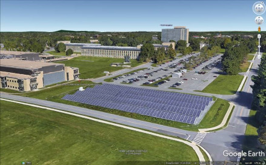
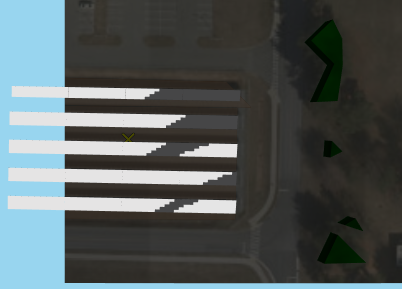
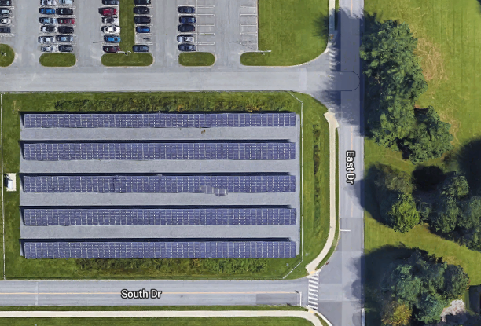
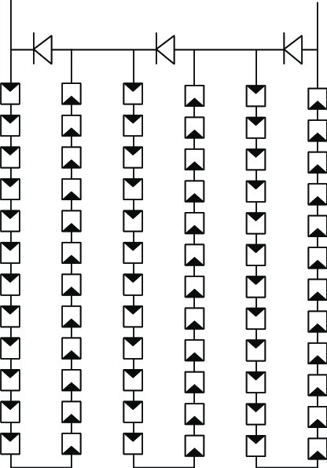
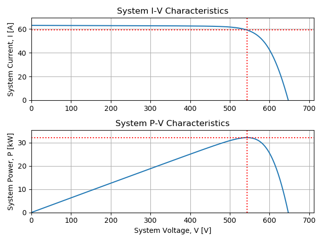
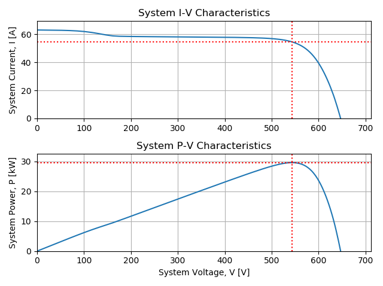
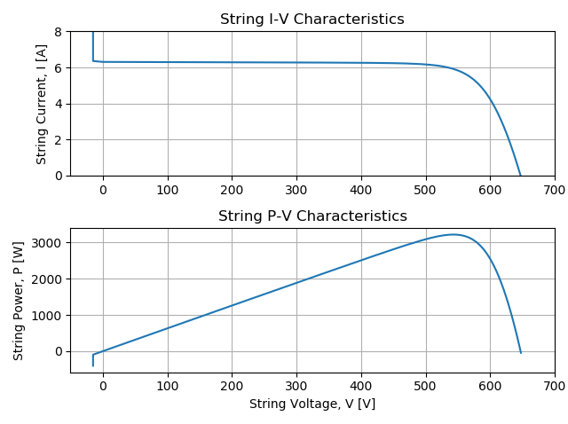
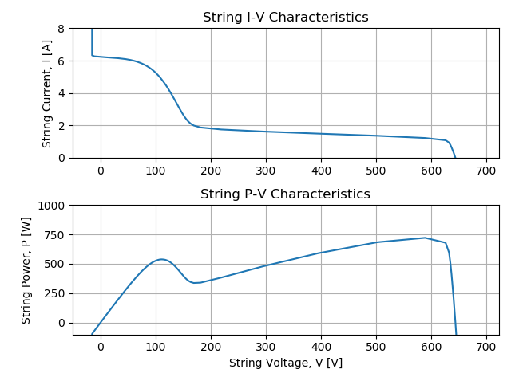

Title: Electric Mismatch in Silicon-Cell PV is Not Intuitive
Date: 2019-10-18 15:23
Category: Solar
Tags: solar, modeling, code
Authors: Mark Mikofski
Summary: Why does shade just across the bottom row of cells cause 90% power loss?

# Uniform Versus Non-Uniform Shade

The counter-intuitive effect of shade on photovoltaic (PV) solar energy panels
surprises most people.

> Shade across a relatively small portion of the panel can cause a
disproportionately large power loss.

For example, shade across just the bottom row of cells, only 6 cells out of 60,
merely 10% of the PV panel, will cause 90% power loss! Why does this happen?
Did you think it would cause only 10% power loss? Why isn't power loss _linear_
with shade?

OK, to be fair, if the entire array is uniformly shaded or merely illuminated
with a less intense light, then the decrease in power _would_ be proportional
to the decrease in light intensity. For example if a giant rain cloud passed
over the sun, or the sun slowly sank behind a mountain, so that the same light
was cast everywhere, but just lower intensity, say 50%, then the power would be
50% lower as well.

So just to be _completely clear_, in this post we are **not** going to talk
about the effects of changes in light intensity that are totally uniform
everywhere, but instead we're going to focus on what happens when there are
non-uniform differences in light intensity across the PV system. Here's an
example of a PV system with non-uniform shade.

# PV Primer

In PV lingo, a panel is called a **module** which, in most silicon PV modules,
is made up of smaller solar **cells** connected in series. Modules are most
often connected in series to form **strings** of modules. Strings are connected
in parallel to an **inverter** which converts DC from the panels to AC which is
sent to the grid.

Here's a typical PV system at the National Institute of Standards and
Technology (NIST) in Gaithersburg, MD, which has a single 260-kW inverter
connected to 96 strings, each with 12
[Sharp NU-U235F2](https://pvfree.herokuapp.com/cec_modules/14738/) 235-W
modules. The first four rows are 5 modules deep, but the last row is only 4
modules deep. The modules are all in landscape and have straight stringing:

Here's a simulation from
[SolarFarmer](https://www.dnvgl.com/services/solar-pv-plant-design-software-solarfarmer-140689)
showing the shadows cast by the eastern trees.

## PV Cells and Reverse Bias Breakdown

The cells in a PV module can be considered roughly as a current source in
parallel with a diode and some resistive elements. Diodes are semiconductors.
In other words, they only conduct current in one direction, called the forward
bias. When a negative voltage, or a reverse bias, is applied to the cell, the
semiconductor won't conduct a current. However, if enough reverse bias is
applied, all semiconductors will eventually breakdown, and carry a current.
This phenomema is called **reverse bias breakdown**, and the **breakdown
voltage** varies between cell technology. A typical front contact p-type
silicon solar cell may breakdown at around -20 volts, while a back-contact
n-type silicon solar cell may breakdown at -5 volts. There are many factors,
beyond the scope of this primer, that affect reverse bias breakdown, such as
purity of the substrate as well as type and concentration of dopant. The most
important thing to understand about reverse bias breakdown is this:

>When a cell is in reverse breakdown, it can carry nearly any current, but
because the voltage is negative, then the cell will dissipate energy and will
get hot as it exchanges heat with the environment around it.

### The Single Diode Model

The electric circuit analog used to describe a solar cell is called the single
diode model. Here's a schematic:

Image credit:
[Sandia PV Performance Modeling Collaborative](https://pvpmc.sandia.gov/modeling-steps/2-dc-module-iv/diode-equivalent-circuit-models/)

The solar cell current-voltage relation, or IV curve, shown below demonstrates
the forward and reverse bias characteristics of a solar cell. The single diode
model matches this response close enough to be used for predictions.

Image credit:
[PV Education, UNSW, ASU, _et al._](https://www.pveducation.org/pvcdrom/modules-and-arrays/mismatch-effects)

## PV Modules and Bypass Diodes

PV modules are usually designed with bypass diodes to avoid energy loss and hot
spots due to cells in reverse bias breakdown by allowing current to bypass the
cells in reverse bias breakdown. The figure below shows a 72-cell module with
3 bypass diodes, each in parallel with a 24-cell submodule (_aka_: substring).

Credit: _Analysis of Power Loss for Crystalline Silicon Solar Module during the
Course of Encapsulation_ by Hong Yang _et al._, April 2015, International
Journal of Photoenergy 2015:1-5 [DOI: 10.1155/2015/251615](https://doi.org/10.1155/2015/251615)

When the voltage in the submodule exceeds a small trigger voltage in the bypass
diode, due to a cell or cells in reverse bias breakdown, then current will flow
through the bypass diode, bypassing the entire submodule. For example, if one
cell in the submodule is in reverse bias breakdown at -20 volts, and the other
23 cells are all normal at 0.6 volts, then the total voltage of the submodule
is -6.2 volts.

$$V_{sub} = -20[V] + 23\left(0.6[V]\right) = -20[V] + 13.8[V] = -6.2[V]$$

So if the trigger voltage of the bypass diode is -0.5 volts, then the current
will pass through the bypass diode. If the module current is 6 amps, then the
bypass diode dissipates only 3 watts and avoids losing 36 watts from the bad
submodule. What's more important than saving energy though, is that the bypass
diode is also a safety device, because the single cell in reverse bias
breakdown would have dissipated 120 watts, which could potentially cause a
fire, and most likely would cause permanent damage to the cell and the module
encapsulant or backsheet. 

# Electric Circuit Theory

So why does non-uniform shade cause this non-linear effect? If we consider the
PV system as an electric circuit, then it must obey the following two laws:

* [Ohm's Law](https://en.wikipedia.org/wiki/Ohm%27s_law)
* [Kirchhoff's Law](https://en.wikipedia.org/wiki/Kirchhoff%27s_circuit_laws)

## Ohms Law

According to Ohm's law, because the cells and modules in a PV system are all in
series, then they must all carry the same current, $I$, the total voltage of
each module, $V_{mod}$, is the sum of the cell voltages in that module, and the
total string voltage, $V_{str}$, is the sum of the module voltages in the string.
In the equation below, $Z$ represents the impedance of each cell in a module or
each module in a string.

$$V = \sum V = I \sum Z$$

The actual relation in a cell is really a bit more complicated than $V=IZ$,
but hopefully this will do to explain electrical mismatch for now. The relation
between the flux of charge and solar cell voltage is described by the
[Poisson Energy Transport Equation](https://en.wikipedia.org/wiki/Poisson%E2%80%93Boltzmann_equation)
but in practice [the single diode model](#the-single-diode-model) circuit
discussed above, is a useful analog. For more detail on the single diode model,
see this post on
[examples of implicit vs. explicit solutions for PV systems](./examples-of-implicit-versus-explicit-solutions-for-photovoltaic-solar-energy-systems.html).

## Kirchhoff's Law

Kirchhoff's law requires the voltage across all of the parallel strings to be
the same as the voltage across the inverter, and the total current at the
inverter nodes to be the sum of the currents from all parallel strings
connected to it.

$$I = \sum I = V\sum{\frac{1}{Z}}$$

# Electrical Mismatch 

The combined effect of enforcing Ohm's and Kirchhoff's laws on a PV system that
is partially shaded can cause what's called _electrical mismatch_. In other
words, the shaded cells can't _match_ the current being carried by the rest of
the module, or the string with shaded modules can't carry the same voltage as
the PV system, and therefore the entire system has to find a new operating
condition to satisfy Ohm's and Kirchhoff's laws.

## A Rule of Thumb
The counter intuitive behavior of a PV array with partial shade can be
understood by remembering the following rule of thumb:

>A submodule will perform as well as its most shaded cell.

Imagine a submodule has the bottom cells completely shaded, so they are only
getting diffuse light, say 10% of the total plane of array irradiance that's
incident on the other cells in the module. The rest of the PV array is
operating normally, so the current and voltage of each string might be 7.8 amps
and 360 volts, assuming the NIST site shown in the [PV Primer](#pv-primer)
above. So, as described in the section on
[PV Cells and Reverse Bias Breakdown](#pv-cells-and-reverse-bias-breakdown),
the two shaded cells can only carry this current in reverse bias breakdown,
which would trigger the bypass diode to activate, and cause the string to lose
one-third of a module's voltage. However, the strings all have to have the same
voltage, and the maximum power point of the system is not going to be at lower
voltage, so the bad submodule can't activate it's bypass diode, and the string
will have to operate at a lower current - the same current as the bad cell.

## PVMismatch
We can analyze this using [PVMismatch](https://sunpower.github.io/PVMismatch/)
Python package by SunPower.

>**TL;DR**: A PV system with just 10% of cells shaded in only 1 string, loses
nearly all of the power in that string.

### Script 
The following scrpt uses PVMismatch to model a PV system at STC with 10 strings
of 10 [SunPower SPR-315E-WHT](https://pvfree.herokuapp.com/pvmodules/1517/)
96-cell modules per string. Then analyzes the same system, but with the bottom
row of cells shaded 80%, _ie_: only diffuse irradiance:

    """
    analyze and plot a 10x10 system with bottom cells of one row shaded
    """

    # import the pvmismatch library
    from pvmismatch import *

    # import the matplotlib plotting library
    from matplotlib import pyplot as plt

    # make a 10x10 system of SPR-E20-315 96-cell panels at stc
    pvsys = pvsystem.PVsystem()

    # plot the system
    pvsys.plotSys()
    plt.tight_layout()

    # shade the bottom cell of all modules in the 1st string by 80%
    pvsys.setSuns(
        {0: {m: {
            'cells': (11, 12, 35, 36, 59, 60, 83, 84),
            'Ee': (0.2,) * 8} for m in range(10)}})

    # plot the btm row shaded system
    pvsys.plotSys()
    plt.tight_layout()

    # btm row shaded system max power
    pvsys.Pmp
    # 29607.549997102204

    # make a new stc system for comparison
    pvsys_stc = pvsystem.PVsystem()

    # stc system max power
    pvsys_stc.Pmp
    # 32119.317380452303

    # calculate loss
    (pvsys_stc.Pmp - pvsys.Pmp) / pvsys_stc.Pmp
    # 0.07820114461332704

    # btm row shaded string max power
    pvsys.pvstrs[0].Pstring.max()
    # 720.6607971888608

    # stc string max power
    pvsys_stc.pvstrs[0].Pstring.max()
    # 3212.7324983909575

    # calculate loss
    (pvsys_stc.pvstrs[0].Pstring.max() - pvsys.pvstrs[0].Pstring.max()) / pvsys_stc.pvstrs[0].Pstring.max()
    # 0.7756860250426105

    # plot stc string
    pvsys_stc.pvstrs[0].plotStr()
    f = plt.gcf()
    f.axes[0].set_ylim([0, 8])
    plt.tight_layout()

    # plot btm row shaded string
    pvsys.pvstrs[0].plotStr()
    f = plt.gcf()
    f.axes[0].set_ylim([0, 8])
    f.axes[1].set_ylim([-100, 1000])
    plt.tight_layout()

 

The maximum power at STC is 32,119 [W].

The maximum power with bottom row shaded) is 29,607 [W]. The calculated the
relative loss, `(pvsys_stc – pvys_btm_row) / pvsys_stc`, is 7.8%.

The string power at STC is 3213 [W].

The string power with the bottom row shaded is 721 [W], and the calculated
relative loss, `(pvstr_stc – pvstr_btm_row) / pvstr_stc`, is 78%.

(Sorry the resolution is a bit poor around the knee, this was a quick
simulation using only 100 points.)